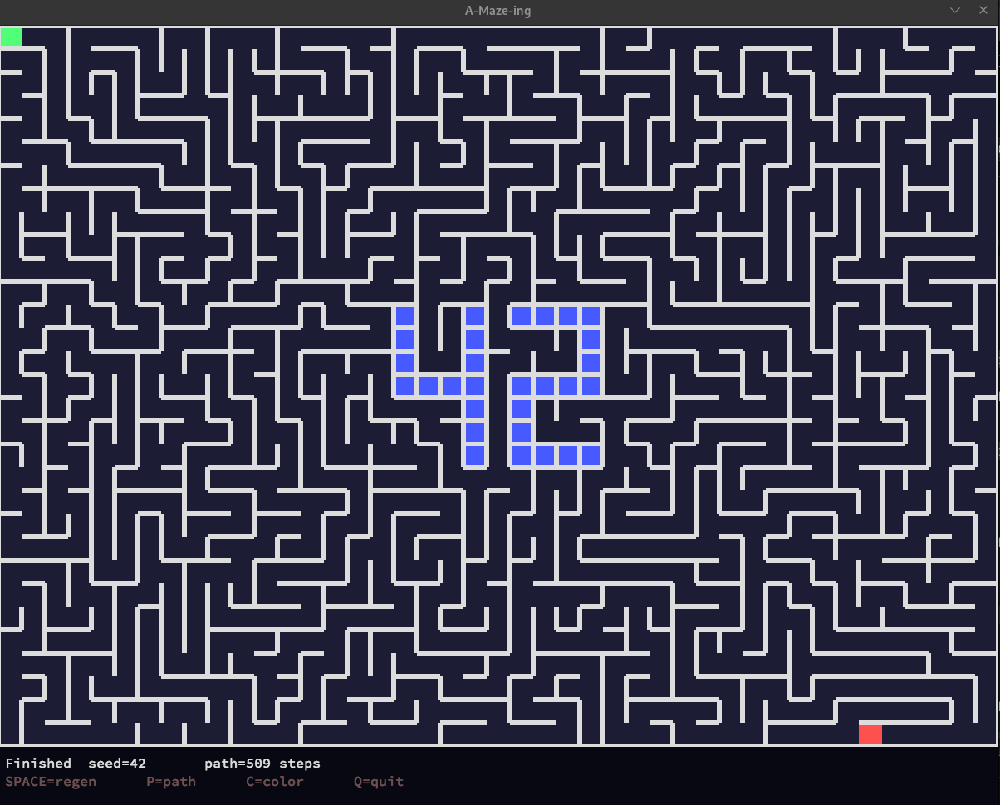
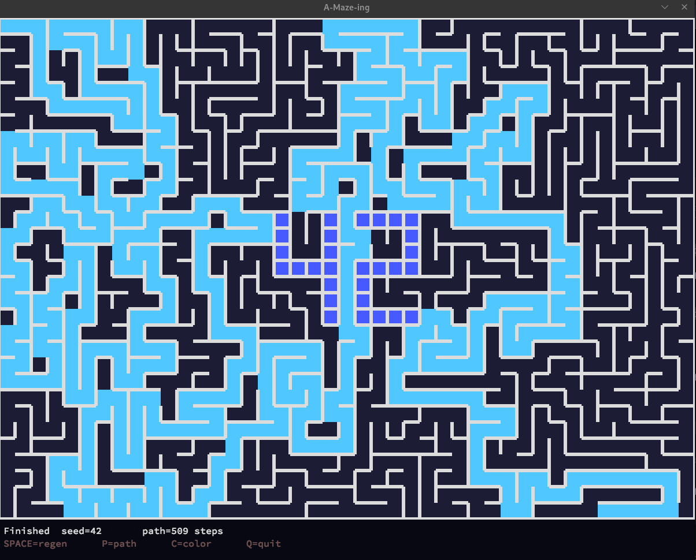

*This project has been created as part of the 42 curriculum by horarivo.*

# A-Maze-ing

| Maze generation preview | Path finding animation preview |
| :---: | :---: |
|  |  |

## Description

A-Maze-ing is an interactive maze generator written in Python. From a plain-text configuration file, it produces a randomly generated maze - perfect or imperfect - displays it in a graphical MLX window, computes the shortest path from entry to exit, and exports the result to a text file using a hexadecimal wall representation.

### Key Features

- **Maze Generation**: Randomly generated maze from a configuration file, with an optional reproducible seed
- **Shortest Path Display**: Show/hide the shortest path from entry to exit
- **42 Pattern**: Central "42" pattern to reinforce the visual identity of the project
- **Color Palette Support**: Cycle through different color schemes

The maze is rendered in an MLX window with walls, entry, exit, and the solution path clearly displayed.

## Instructions

### Requirements

- Python 3.10 or higher
- `mlx` module compatible with Python 3 (provided as `mlx-2.2-py3-none-any.whl`, must be placed at the repository root)

### Installation

A `Makefile` is provided to automate setup. It creates a virtual environment (`.venv`), installs the lint/build dependencies, and installs the MLX wheel into it:

```bash
make install
```

This runs, in order:

```bash
python3 -m venv .venv
. .venv/bin/activate && pip install --upgrade pip
. .venv/bin/activate && pip install -r requirements.txt
. .venv/bin/activate && pip install mlx-*.whl
```

If you prefer to do it manually:

1. Install Python 3.10+.
2. Create and activate a virtual environment:

```bash
python3 -m venv .venv
source .venv/bin/activate
```

3. Install the lint/build dependencies:

```bash
pip install -r requirements.txt
```

4. Install the MLX module from the provided wheel:

```bash
pip install mlx-2.2-py3-none-any.whl
```

### Execution

1. Edit `config.txt` or create a custom configuration file.
2. Run the application:

```bash
make run
```

or, equivalently:

```bash
. .venv/bin/activate && python3 a_maze_ing.py config.txt
```

### Other Makefile targets

- `make debug`: runs the program under `pdb`.
- `make lint`: runs `flake8` and `mypy` with the mandatory flags.
- `make lint-strict`: runs `flake8` and `mypy --strict`.
- `make clean`: removes caches (`__pycache__`, `.mypy_cache`, `.pytest_cache`) and the `.venv` directory.

### Keyboard controls

- `SPACE`: regenerate a new maze
- `P`: show/hide the shortest path
- `C`: cycle through color palettes
- `Q` or `ESC`: quit the application


## Config file

The configuration file must contain one value per line in `KEY=VALUE` format. Lines starting with `#` are comments and ignored.

Expected keys:

- `WIDTH`: maze width in cells (integer >= 5)
- `HEIGHT`: maze height in cells (integer >= 5)
- `ENTRY`: entry coordinates in `x,y` format
- `EXIT`: exit coordinates in `x,y` format
- `OUTPUT_FILE`: output file path
- `PERFECT`: `True` or `False` to enable or disable loops
- `SEED`: optional integer to seed random generation

### Example configuration

```text
WIDTH=13
HEIGHT=11
ENTRY=0,0
EXIT=1,1
OUTPUT_FILE=maze.txt
PERFECT=True
SEED=42
```

## Generation algorithm

The project uses the "Recursive Backtracker" algorithm to generate the maze. This algorithm walks the maze cells, opens passages to unvisited neighbors, and backtracks when no valid neighbor remains.

### Why this algorithm?

- It is simple to implement and easy to visualize.
- It produces perfect mazes with a single path between cells.
- It fits naturally with step-by-step generation.
- It is suitable for adding visual features such as the "42" pattern and path solving.

## Reusable parts

Reusable parts of the project include:

- `mazegen/config.py`: configuration file parser that can be reused by other applications.
- `mazegen/generator.py`: independent maze generator that produces a grid of walls and passages.
- `mazegen/solver.py`: BFS solver for the shortest path in a maze grid.
- `mazegen/renderer.py`: rendering and file writing helpers.

These components can be reused in other maze, game, or graphical application projects.

## Advanced features

- Central "42" pattern: some cells remain fully walled to draw the pattern.
- Interactive shortest path display.
- Three different color palettes.
- `PERFECT=False` option to generate imperfect mazes with loops.
- Export of the result as a text file in the expected format.

## Project structure

```text
a-maze-ing/
├── a_maze_ing.py       - main executable
├── config.txt          - example configuration
├── Makefile            - install / run / debug / clean / lint targets
├── pyproject.toml      - package configuration
├── requirements.txt    - development dependencies
└── mazegen/
    ├── __init__.py     - public API of the package
    ├── app.py          - MLX interface, rendering, and event handling
    ├── config.py       - configuration parsing and validation
    ├── constants.py    - constants and color palettes
    ├── generator.py    - maze generation
    ├── renderer.py     - rendering and output writing
    └── solver.py       - maze solving
```

## Project management

### Team

- `horarivo`: maze generation algorithm, design, and documentation
- `mandrini`: path finding algorithm, testing

### Planning

1. Analyze the project requirements and define features.
2. Implement the configuration parser.
3. Develop the maze generator.
4. Add MLX rendering and the BFS solver.
5. Integrate the "42" pattern, palettes, and keyboard controls.
6. Test and export the output file.

### What worked well

- The modular project structure simplified implementation.
- Separating configuration, generation, rendering, and solving made the code easier to read.
- The "42" pattern adds a notable visual touch.

### Improvements possible

- Add multiple generation algorithms (Prim, Kruskal, Aldous-Broder).
- Add animated generation and path display.
- Add more advanced rendering options (zoom, grid overlay).

### Tools used

- Python 3.10+
- `pip` and `venv` for dependency management and isolation
- `mlx` / MiniLibX for graphical output
- Git for version control

## Resources

- Maze generation algorithm: depth-first search / recursive backtracker
- Breadth-first search (BFS) for shortest path solving
- MLX / MiniLibX documentation for graphical output
- Classic maze-related articles: "Maze generation algorithm" and "Depth-first search maze"

### AI usage

- **Code Review**: AI assistance was used to review the generator, solver, and rendering modules for bugs.
- **Documentation**: AI was used to enhance comments and docstrings throughout the codebase.
- **Packaging Guidance**: AI helped clarify how to correctly bundle a non-Python asset inside the `mazegen` wheel.